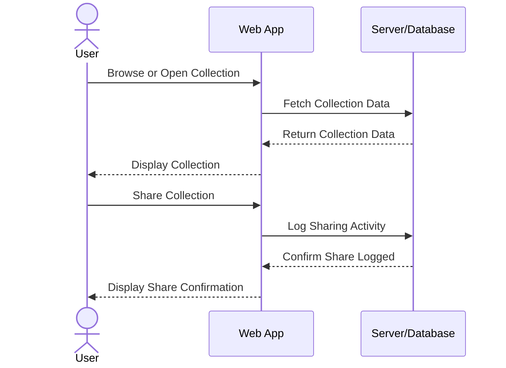

# Pop Depot

Pop Depot is the online extension of the popular Pop Mart store. It brings the excitement of blind boxes to the digital world, featuring popular characters like Hirono, Nyota, and Inosoul. Collect virtual figurines, build your collection, and share with your friends, all in one platform. 

## 🚀 Specification Deliverable

For this deliverable I did the following. I checked the box `[x]` and added a description for things I completed.

- [x] Proper use of Markdown
- [x] A concise and compelling elevator pitch
- [x] Description of key features
- [x] Description of how you will use each technology
- [x] One or more rough sketches of your application. Images must be embedded in this file using Markdown image references.

### Elevator pitch

Have you ever been tempted by the adorable figures at Pop Mart but hesitated at the $15.99 price tag? Pop Cloud brings the same thrill of opening blind boxes to your screen –– for free! With Pop Cloud, you can collect virtual figures, experience the excitement of surprise, and share your collection with friends near and far, all without spending a dime.  

### Design

Here is a sequence diagram of how users would interact with the backend to share their collections.

### Key features

- Secure login over HTTPS
- Ability to select blind box collection
- Randomization of selected collection
- Ability to add to collection
- Ability to view full collection
- Ability to chat with friends
- Share collection with friends

### Technologies

I am going to use the required technologies in the following ways.

- **HTML** - Use correct HTML structure. Use HTML for all 5 pages: login, blind box selection, blind box reveal, figurine collection, and chatroom. Links will be used on the blind box reveal page and figurine  collection page.
- **CSS** - Application styling that looks good on different size screens. Complementary colors that pass accessibility. Even spacing between collections. Links styled as buttons.
- **React** - Provides login, collection display, adding figurine to collection, display full collection, share full collection, view friend's collection
- **Service** - Backend service with endpoints for: login, saving figure to collection, and sharing collection with friends. The public API 'Gitter' will be used for the chatroom. 
- **DB/Login** - Stores users, figures collections, and chats with friends in database. Register and login users. Credientials securely stored in database.
- **WebSocket** - Chatting and sharing collection with friends.

## 🚀 AWS deliverable

For this deliverable I did the following. I checked the box `[x]` and added a description for things I completed.

- [x] **Server deployed and accessible with custom domain name** - [My server link - Pop Depot](https://popdepot.click/).

## 🚀 HTML deliverable

For this deliverable I did the following. I checked the box `[x]` and added a description for things I completed.

- [x] **HTML pages** - Five HTML pages: Home, Blind Box Selection, Collection, Chat, and About. Each page presents its respective layout and functionality.
- [x] **Proper HTML element usage** - Each page has head, body, nav, and footer. Header tags, table tags, div tags, and paragraph tags were used to format the rest of the pages.
- [x] **Links** - Updated link names. All links can be accessed from every page. Created an additional link for the chat page and a link to directly share collection on the collection page.
- [x] **Text** - The text describing the application on the 'About' page was updated. A description of what a blind box is has been added to the 'Blind Box' page.
- [x] **3rd party API placeholder** - Created a page for the chatting API 'Gitter' to be used. Placeholder is represented by the messaging box.
- [x] **Images** - Changed the image on the about.html page. Added in images of what the figures will be for the blind boxes and what it will look like on the shelves in the collection page. 
- [x] **Login placeholder** - The login placeholder is located on the 'Home' page, in the index.html file.
- [x] **DB data placeholder** - Database data will be used for managing users, figure collections, and chatting with friends. Specifically, the database placeholders are found in the login functionality, the 'Collection' page, and the 'Chat' page. The 'Collection' page will use database data to track which figures the user has received, and the 'Chat' page will use it to save friends and chat history.
- [x] **WebSocket placeholder** - The WebSocket placeholder is on the'Chat' page. 

## 🚀 CSS deliverable

For this deliverable I did the following. I checked the box `[x]` and added a description for things I completed.

- [x] **Header, footer, and main content body** - All headers, footers, and main content has been styled with CSS specifically using colors and fonts. 
- [x] **Navigation elements** - Navigation elements are found at the top of the page. Using 'active' in CSS, users can see what page they are on.
- [x] **Responsive to window resizing** - The pages are responsive to window resizing. When the window is resized to a small size, a small toggle appears.
- [x] **Application elements** - Created buttons enhance the page's appearance. Used margin spacing to prevent elements from being too close together. 
- [x] **Application text content** - Used consistent fonts and font colors across pages. Applied a semi-transparent background to the text on the 'About' page to improve accessibility.
- [x] **Application images** - Included images on the Blind Box page, showing the figures useres could recieve.

## 🚀 React part 1: Routing deliverable

For this deliverable I did the following. I checked the box `[x]` and added a description for things I completed.

- [x] **Bundled using Vite** - I completed bundling with Vite.
- [x] **Components** - Login and Chat are both components with mock implementations for login and WebSocket. Selecting the Sign In and Register buttons will navigate the user to the 'Blind Boxes' page. The Collection page displays the database where figures obtained from blind boxes will be stored. The Chat page contains placeholders for where the WebSocket functionality will be implemented.
- [x] **Router** - Routing between login and blind boxes components as well as routing between collection and chat.

## 🚀 React part 2: Reactivity

For this deliverable I did the following. I checked the box `[x]` and added a description for things I completed.

- [x] **All functionality implemented or mocked out** - Everything is working. The 'chat' page is mocked out for the websocket implementation. 
- [x] **Hooks** - Used 'useState' on all pages. 'useEffect' is used on the 'Chat' and 'About' page.

## 🚀 Service deliverable

For this deliverable I added backend endpoints that receives selected blindboxes and returns the blindboxes to the collections page.
- [x] **Node.js/Express HTTP service** - HTTP services can be seen in the index.js code implementing get, delete, and post.
- [x] **Static middleware for frontend** - Static middleware for frontend implentation can be found in the index.js code.
- [x] **Calls to third party endpoints** - A call to a third party service is made on the About page. The service used is YouTube, which utilizes a YouTube API key to pull videos from a playlist.
- [x] **Backend service endpoints** - Placeholders for login that stores the current user on the server. Endpoints added for adding new blind boxes to the collection.
- [x] **Frontend calls service endpoints** - Used fetch to connect the frontend to the endpoints.

## 🚀 DB/Login deliverable

For this deliverable I did the following. I checked the box `[x]` and added a description for things I completed.

- [x] **User registration** - Users are able to register. Registration information is successfully stored in MongoDB.
- [x] **User login and logout** - Once registered, users are able to log in and out.
- [x] **Stores data in MongoDB** - Selected blindboxes are added to a collection, allowing users to view them later. This data is stored in MongoDB. 
- [x] **Stores credentials in MongoDB** - User emails and hashed passwords are securely stored in MongoDB.
- [x] **Restricts functionality based on authentication** - Unregistered users can navigate and view blindboxes but are restricted from adding them to a collection.
## 🚀 WebSocket deliverable

For this deliverable I used websocket to show in realtime of the users logging in. 

- [x] **Backend listens for WebSocket connection** - Through peerProxy.js, the backend Websocket connection is successful.
- [x] **Frontend makes WebSocket connection** - Through the unauthenticated.jsx and about.jsx the frontend WebSocket connection is successful.
- [x] **Data sent over WebSocket connection** - Data related to users who have logged in is successfully transmitted from the backend to the frontend.
- [x] **WebSocket data displayed** - Websocket data is displayed on that about page.
- [x] **Application is fully functional** - Everything in my Pop Depot application is functional!
